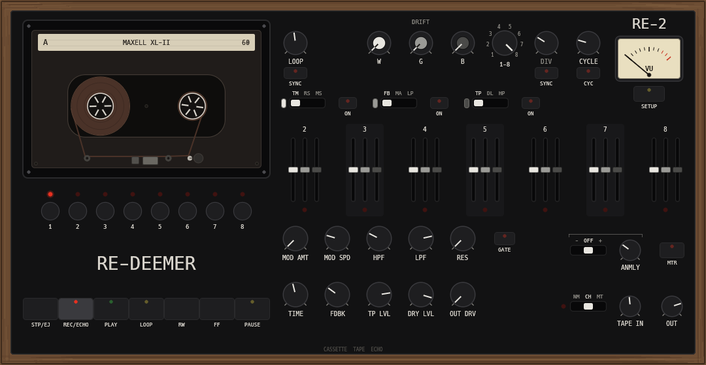

# RE-DEEMER — Cassette Tape Echo

A software realization of a cassette tape echo instrument that was announced
around 2018, pre-ordered by many, and never shipped. The preorder, redeemed:
free, for everyone who waited.

**[Website & download](https://naturarum.github.io/re-deemer/)** ·
**[Latest release](https://github.com/naturarum/re-deemer/releases/latest)** ·
**[Manual](MANUAL.md)** · **[Changelog](CHANGELOG.md)**



**Formats:** VST3 · CLAP · AUv2 (via clap-wrapper). macOS universal
(signed & notarized), Windows and Linux (CI-built each release). Built in
Rust on [nice-plug](https://codeberg.org/RustAudio/nice-plug).

## What's inside

The tape is real, not a delay line: a position-indexed tape buffer at a fixed
96 kHz tape rate with fixed record/repro heads and a motor model. TIME is
motor speed — turning it repitches everything already on tape; MTR drags the
pitch to a dead stop; RW/FF shuttle the actual tape; the cassette-synth and
PLAY-mode manipulation fall out of the same physics.

- **Magnetics:** Jiles–Atherton hysteresis (Chowdhury, DAFx-19) solved with
  RK4 at 2×/4×/8× oversampling; bias blends the anhysteretic (ideally biased)
  path against the raw hysteresis loop. Tape types I/II/IV change saturation,
  EQ, self-erasure and hiss.
- **Tape stock & aging:** fourteen real-world cassettes in three grades set
  hiss, headroom and wear rate; the tape audibly ages while the transport
  rolls (wear is saved with the project, and eject loads a fresh one). The
  spools in the window move on real tape footage over a 30-minute side.
- **Heads & EQ:** record pre-emphasis (HF saturates first), de-emphasis,
  speed-tracking head bump and gap loss, spacing loss, level-dependent HF
  self-erasure.
- **Mechanism:** always-on wow/flutter/scrape calibrated to ~0.15% RMS,
  dropouts and bias sag scaling with the MECH control; tape noise is
  recorded *onto* the tape so it regenerates through the feedback loop.
- **Filters:** 24 dB/oct OTA ladder HPF + LPF (ZDF), resonance to clean
  self-oscillation with pitch tracking; the RES gate turns the 1–8 buttons
  into an 8-pitch filter keyboard (MIDI C3–G3, enabled in SETUP).
- **Positions & Sets:** 3 sets × 8 positions (21 faders), per-set DRIFT slew
  0–14 s, Cycle from 8 s/step to 4,000 steps/s with a sample-accurate clock,
  host-tempo sync phase-locked to the playhead. Anomaly fires a motor hiccup
  on the cycle's final step.
- **Transport:** REC/ECHO, PLAY, LOOP (erase bypass = sound-on-sound
  layering), RW/FF, PAUSE, STP/EJ (double-press ejects to a fresh cassette).

## Building

```bash
rustup default stable          # 1.87+
cargo xtask bundle te2-plugin --release            # VST3 + CLAP
cargo xtask bundle-universal te2-plugin --release  # macOS universal
```

Run from the repo root (the `xtask` alias only resolves there). Bundles land
in `target/bundled/`. Install:

- `RE-DEEMER.vst3` → `~/Library/Audio/Plug-Ins/VST3/`
- `RE-DEEMER.clap` → `~/Library/Audio/Plug-Ins/CLAP/`

### AUv2

The AU is a [clap-wrapper](https://github.com/free-audio/clap-wrapper)
component that loads the installed CLAP, so install the CLAP first.

```bash
cmake -B wrapper-au/build -S wrapper-au -DCMAKE_BUILD_TYPE=Release
cmake --build wrapper-au/build
cp -r wrapper-au/build/RE-DEEMER.component ~/Library/Audio/Plug-Ins/Components/
auval -v aumf Rdmr Ntrm
```

Or run `./scripts/package.sh`, which does all of the above plus tests and
produces the distribution zip. `scripts/notarize.sh` signs/notarizes a
release (needs a Developer ID; see [README-RELEASING.md](README-RELEASING.md)).

### Dev tools

```bash
cargo test --workspace --release       # DSP test suite: timing, repitch, W&F,
                                       # magnetics, sequencer, aging, transport
cargo run -p te2-render --release -- gen pluck /tmp/p.wav
cargo run -p te2-render --release -- render /tmp/p.wav /tmp/echo.wav \
    --time 0.4 --feedback 0.8 --lpf 2500 --tail 6
cargo run -p te2-plugin --release --features standalone --bin te2-standalone
cargo run -p te2-plugin --release --features snapshot --bin te2-snapshot out.png
```

## Validation status

| Check | Result |
| --- | --- |
| clap-validator 0.3.2 | all run, 0 failed |
| pluginval 1.0.4, strictness 10 (VST3) | SUCCESS |
| auval (`aumf Rdmr Ntrm`) | PASS |
| te2-dsp test suite | 47/47 |
| Engine CPU (48 kHz stereo, 4× OS) | ~13× realtime on one Apple-silicon core |

## Notes

- License: [ISC](LICENSE). `vendor/baseview` is a patched fork of
  [baseview](https://github.com/RustAudio/baseview) (MIT/Apache-2.0) fixing a
  host-KVO recursion crash; see the patch comments.
- The `vst3` bindings are MIT/Apache-2.0, but distributing VST3 *binaries*
  involves Steinberg's VST3 licensing terms (or GPLv3). CLAP and AU carry no
  such strings.
- Windows and Linux builds come from CI (`.github/workflows/
  plugins-portable.yml`) and pass clap-validator there; they're younger
  than the macOS builds — reports welcome.
- Save your own presets in **SETUP → PRESETS** (stored in your user config
  folder); `PRESETS.md` has 16 starter panel recipes; `ROADMAP.md` is what's
  next.

*A tribute. You waited long enough.*
